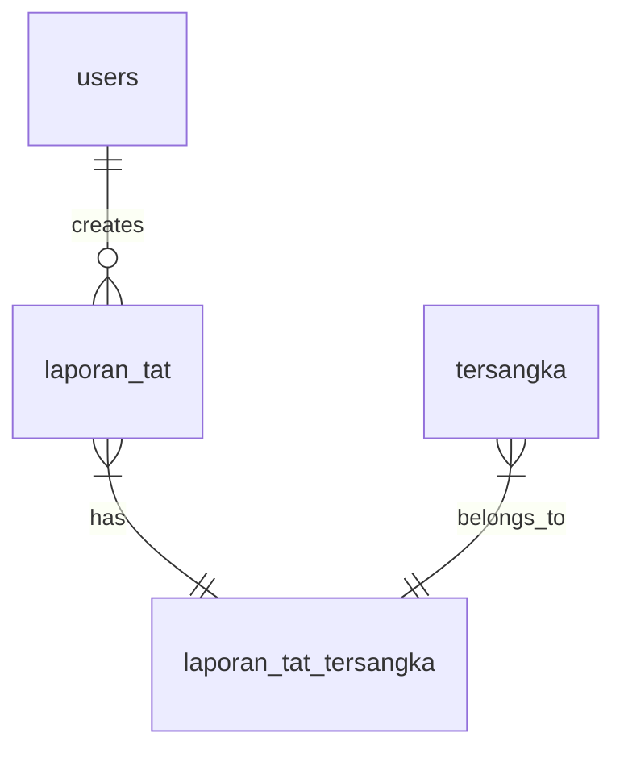

# 🛡️ Sistem TAT (Titik Alih Teknologi)

<div align="center">


**Sistem Manajemen Laporan TAT yang Modern dan Professional**

[Demo](#) | [Dokumentasi](#dokumentasi) | [Installation](#installation) | [Contributing](#contributing)

</div>

---

## 📖 Tentang Sistem TAT

Sistem TAT (Titik Alih Teknologi) adalah aplikasi web management system yang dibangun dengan Laravel untuk mengelola laporan dan administrasi TAT. Sistem ini dirancang dengan fokus pada **user experience**, **security**, dan **performance**.

### ✨ Fitur Utama

- 🔐 **Authentication System** - Secure login dengan session management
- 📋 **Laporan Management** - CRUD operations untuk laporan TAT
- 👥 **Tersangka Management** - Data tersangka dengan foto KTP
- 📎 **File Upload System** - Multi-file upload dengan custom naming
- 📱 **Responsive Design** - Mobile-first approach
- 🎨 **Professional UI** - Navy Blue, Gold, White theme
- 🔍 **Advanced Search** - Filter dan pencarian data


### 🎨 Design System

Sistem menggunakan kombinasi warna yang mencerminkan profesionalisme:
- **Navy Blue (#003366)** - Authority & Trust
- **Gold (#FFD700)** - Excellence & Importance  
- **White (#FFFFFF)** - Clarity & Cleanliness

---

## 🚀 Quick Start

### Prerequisites

Pastikan sistem Anda memiliki requirements berikut:

```bash
PHP >= 8.1
Composer
Node.js >= 16.0
MySQL >= 8.0
```

### Installation

1. **Clone repository**
   ```bash
   git clone https://github.com/finn789/Sistem_infomasi_tat_bnnp.git
   cd sistem-tat
   ```

2. **Install dependencies**
   ```bash
   composer install
   npm install
   ```

3. **Setup environment**
   ```bash
   cp .env.example .env
   php artisan key:generate
   ```

4. **Configure database**
   ```env
   DB_CONNECTION=mysql
   DB_HOST=127.0.0.1
   DB_PORT=3306
   DB_DATABASE=sistem_tat
   DB_USERNAME=your_username
   DB_PASSWORD=your_password
   ```

5. **Run migrations**
   ```bash
   php artisan migrate --seed
   ```

6. **Setup storage**
   ```bash
   php artisan storage:link
   ```

7. **Build assets & start server**
   ```bash
   npm run dev
   php artisan serve
   ```

8. **Access application**
   ```
   URL: http://localhost:8000
   Email: admin1@gmail.com
   Password: password
   ```

---


## 🔧 Configuration

### Environment Variables

```env
# Application
APP_NAME="Sistem TAT"
APP_ENV=production
APP_URL=https://your-domain.com

# Database
DB_CONNECTION=mysql
DB_HOST=127.0.0.1
DB_PORT=3306
DB_DATABASE=sistem_tat

# File Storage
FILESYSTEM_DISK=public

# Mail Configuration
MAIL_MAILER=smtp
MAIL_HOST=your-smtp-host
MAIL_PORT=587
MAIL_USERNAME=your-username
MAIL_PASSWORD=your-password
```

### File Upload Settings

```php
// config/filesystems.php
'public' => [
    'driver' => 'local',
    'root' => storage_path('app/public'),
    'url' => env('APP_URL').'/storage',
    'visibility' => 'public',
    'throw' => false,
],
```

---

## 📊 Database Schema

### Core Tables

#### `users`
- Manages system users (admin, operator)
- Authentication & authorization

#### `laporan_tat`
- Main reports table
- File attachments storage
- Status tracking

#### `tersangka`
- Suspect information
- KTP photo management

#### `laporan_tat_tersangka`
- Pivot table for many-to-many relationship
- Links reports with suspects

### Relationships



---

## 🎯 API Endpoints

### Authentication
```http
POST   /login              # User login
POST   /logout             # User logout
GET    /dashboard          # Dashboard access
```

### Laporan Management
```http
GET    /operator/laporan                    # List all reports
GET    /operator/laporan/create             # Create form
POST   /operator/laporan                    # Store report
GET    /operator/laporan/{id}               # View report
GET    /operator/laporan/{id}/edit          # Edit form
PUT    /operator/laporan/{id}               # Update report
DELETE /operator/laporan/{id}               # Delete report
DELETE /operator/laporan/bulk               # Bulk delete
DELETE /operator/laporan/{id}/file          # Delete specific file
```

### File Management
```http
POST   /operator/laporan/{id}/upload        # Upload files
GET    /storage/laporan-tat/{file}          # Download files
DELETE /operator/laporan/{id}/file/{type}   # Delete file
```

---

## 🔒 Security Features

### Authentication
- Laravel Sanctum for API authentication
- Session-based web authentication
- CSRF protection on all forms
- Password hashing with bcrypt

### File Security
- File type validation (PDF, DOC, DOCX, Images)
- File size limits (2MB per file)
- Secure file naming with timestamps
- Protected storage directories

### Database Security
- Prepared statements (Eloquent ORM)
- Input validation & sanitization
- SQL injection prevention
- XSS protection

### Access Control
```php
// Middleware groups
'web' => [
    \App\Http\Middleware\EncryptCookies::class,
    \Illuminate\Session\Middleware\StartSession::class,
    \App\Http\Middleware\VerifyCsrfToken::class,
],

'auth' => [
    \App\Http\Middleware\Authenticate::class,
],
```

---

## 🎨 UI Components

### Custom Components
- **Auth Components**: Login form, session status
- **Form Components**: Input fields, file uploads
- **Layout Components**: Navigation, sidebar
- **Data Components**: Tables, cards, modals

### Styling Framework
- **Base**: Tailwind CSS
- **Icons**: Font Awesome 6
- **Fonts**: Figtree (Google Fonts)
- **Animation**: CSS3 transitions & keyframes

### Design Tokens
```css
:root {
  --navy-blue: #003366;
  --gold: #FFD700;
  --white: #FFFFFF;
  --navy-light: #004080;
  --gold-dark: #E6C200;
}
```

---

## 📱 Browser Support

| Browser | Version |
|---------|---------|
| Chrome  | 90+     |
| Firefox | 88+     |
| Safari  | 14+     |
| Edge    | 90+     |

---

## 🚀 Deployment

### Production Setup

1. **Server Requirements**
   ```bash
   PHP 8.1+
   MySQL 8.0+
   Nginx/Apache
   SSL Certificate
   ```

2. **Build for Production**
   ```bash
   composer install --optimize-autoloader --no-dev
   npm run build
   php artisan config:cache
   php artisan route:cache
   php artisan view:cache
   ```

3. **Environment Configuration**
   ```env
   APP_ENV=production
   APP_DEBUG=false
   APP_URL=https://your-domain.com
   ```

4. **File Permissions**
   ```bash
   chmod -R 755 /path/to/your/project
   chmod -R 775 storage bootstrap/cache
   ```

### Docker Deployment
```dockerfile
FROM php:8.1-fpm-alpine

# Install dependencies
RUN apk add --no-cache nginx wget

# Copy application
COPY . /var/www/html

# Set permissions
RUN chown -R www-data:www-data /var/www/html
```

---


## 🐛 Troubleshooting

### Common Issues

#### **Storage Link Error**
```bash
# Solution
php artisan storage:link
chmod -R 775 storage
```

#### **Database Connection Error**
```bash
# Check database credentials in .env
# Ensure MySQL service is running
sudo service mysql start
```

#### **File Upload Issues**
```bash
# Check PHP configuration
upload_max_filesize = 2M
post_max_size = 8M
max_execution_time = 300
```

#### **Assets Not Loading**
```bash
# Rebuild assets
npm run build
php artisan view:clear
```

---

## 📄 License

Distributed under the MIT License. See `LICENSE` for more information.

---

## 👨‍💻 Authors & Contributors

- **Main Developer** - [Your Name](https://github.com/your-username)
- **UI/UX Designer** - [Designer Name](https://github.com/designer-username)

See the full list of [contributors](https://github.com/your-username/sistem-tat/contributors) who participated in this project.

---

## 📞 Support & Contact

- **Email**: support@sistemtat.com
- **Documentation**: [docs.sistemtat.com](https://docs.sistemtat.com)
- **Issues**: [GitHub Issues](https://github.com/your-username/sistem-tat/issues)
- **Discussions**: [GitHub Discussions](https://github.com/your-username/sistem-tat/discussions)

---

## 🙏 Acknowledgments

- Laravel Framework Team
- Tailwind CSS Team
- Font Awesome Team
- All open source contributors

---

<div align="center">

**⭐ Star this repository if it helped you!**

Made with ❤️ for Indonesian Government Technology Initiative

</div>